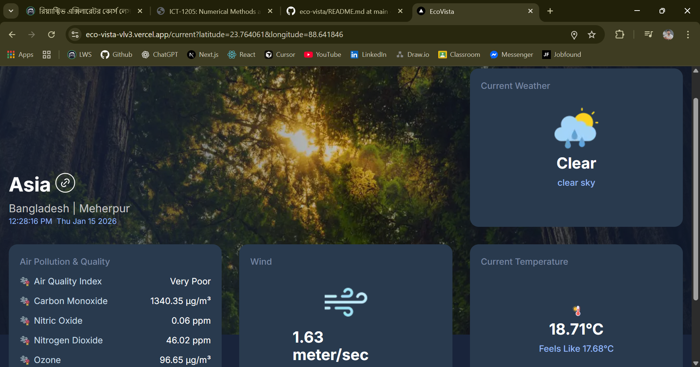

# 🌿 EcoVista

EcoVista is a modern web application built with Next.js App Router that visualizes ecological and environmental data from external public APIs along with custom APIs built inside Next.js.
The project focuses on presenting climate, environmental, and sustainability-related information through a clean, responsive, and immersive user interface.

---

## 💻 Features


- 🌱 Ecological data dashboard as homepage
- 🔌 Data fetched from external environmental APIs
- 🧩 Custom API routes built with Next.js Route Handlers
- 📊 Formatted metrics (temperature, air quality, humidity, etc.)
- 🚫 Custom 404 pages for invalid routes or data
- ⚡ Optimized images using next/image
- 📊 Parallel slots for different segment

---

## 🛠 Tech Stack

- **Next.js 14** 
- **React.js**
- **Tailwind CSS**
- **External REST APIs (environment & ecology related)**


## 🖼️ Screenshots

| Home Page | News Detail Page |
|-----------|-----------------|
|  |  |


## 📂 Project Structure

```
assignment-7/
├── app/
│   ├── [location]          
|   |     ├── @aqi
|   |     ├── @temperature      
|   |     ├── @wind         
│   |     ├── @weather
|   |     |     ├── bn.json
|   |     |     └── en.json
|   |     ├── layout.js
|   |     └── page.js              
│   ├── api/location
│   |    ├── [name]
|   |    ├── location-util.js
│   |    └── route.js 
├── components/            
│   ├── AQIComponent.jsx
|   ├── Card.jsx
│   └── ...other components
├── lib/
│   ├── location-data.json
|   └── location-info.js                 
├── package.json
└── tailwind.config.js      

```


---

## 🚀 Getting Started
 
```bash
git clone [https://github.com/Learn-with-Sumit/batch-4-assignment-7-dev-news-nh-nahid](https://github.com/nh-nahid/eco-vista.git)
cd eco-vista

npm install
npm run dev
# or
yarn dev

Open http://localhost:3000
to view the project.

```

## 📝 Usage

- Explore ecological and environmental data from the homepage.
- Invalid routes or unavailable data show a custom 404 page.
- Metrics are automatically formatted for readability.
- External API delays can be simulated using browser dev tools.


## 🔗 Future Improvements

- Integrate more environmental APIs (climate, biodiversity, pollution).
- Add location-based ecological insights.
- Cache API responses for performance optimization.
- Add charts and visualizations for environmental trends.

## 👨‍💻 Author

Nahid Hossain
- 💻 I love building innovative web applications.
- 🎯 Focused on solving real-world problems with technology.
- 🌱 Always learning and experimenting with new technologies.

## 📄 License
All right reserved by LWS
